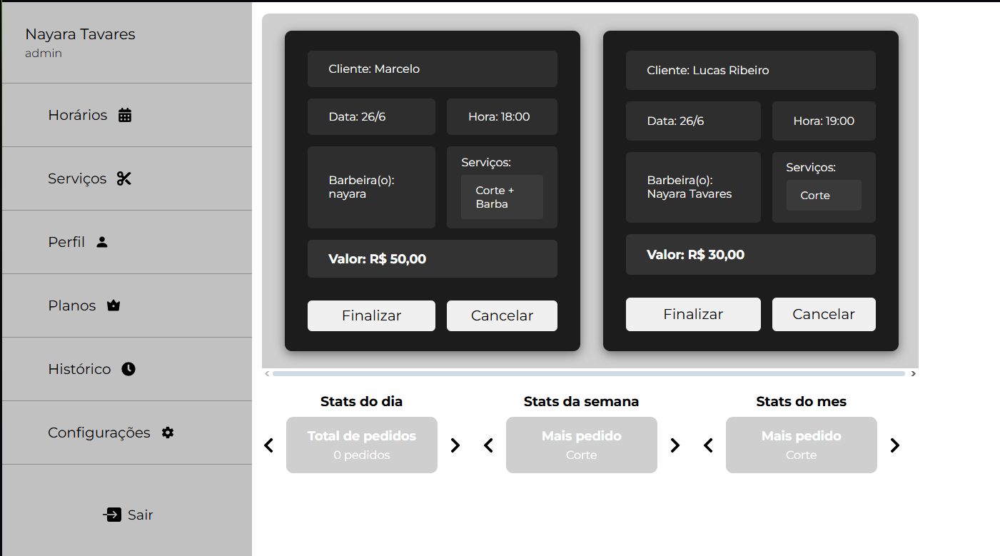
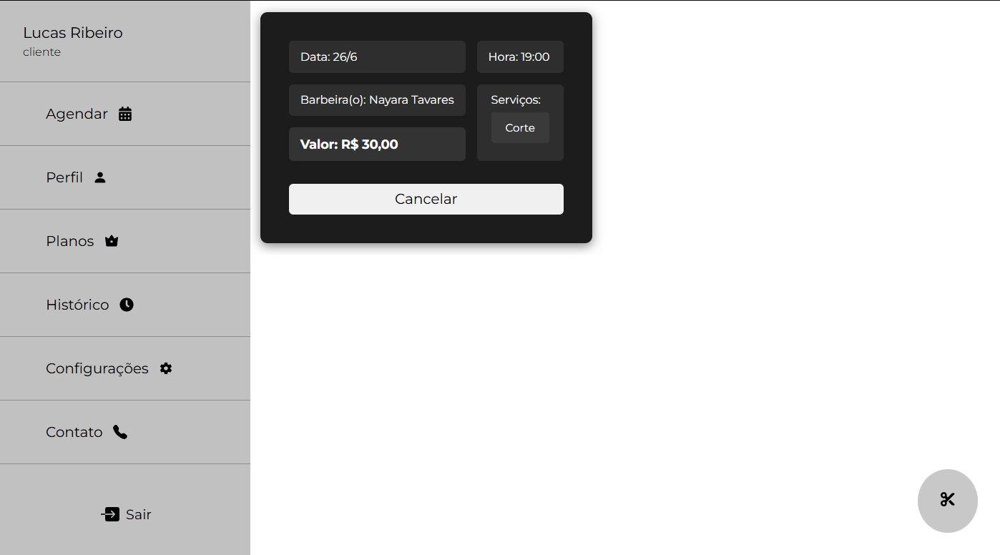
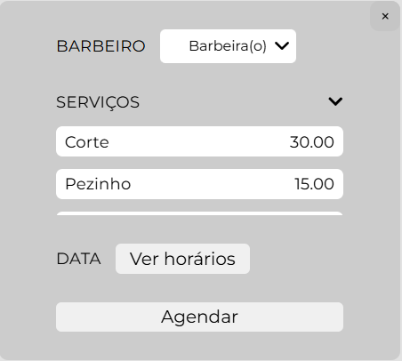
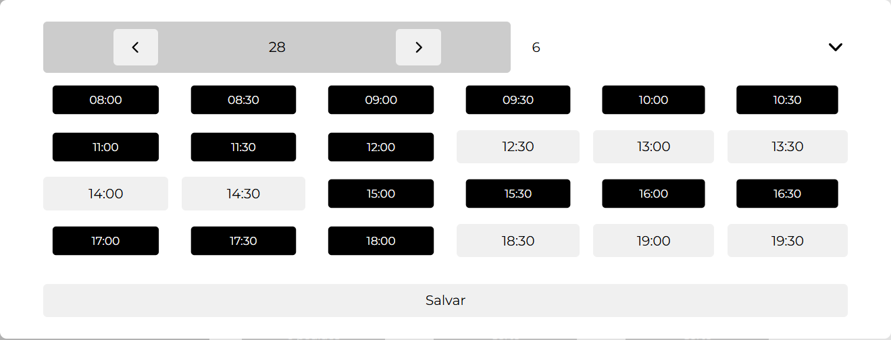
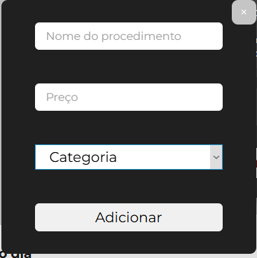
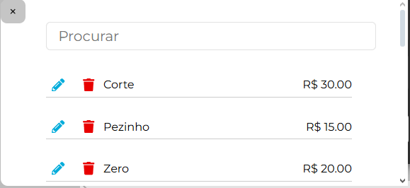
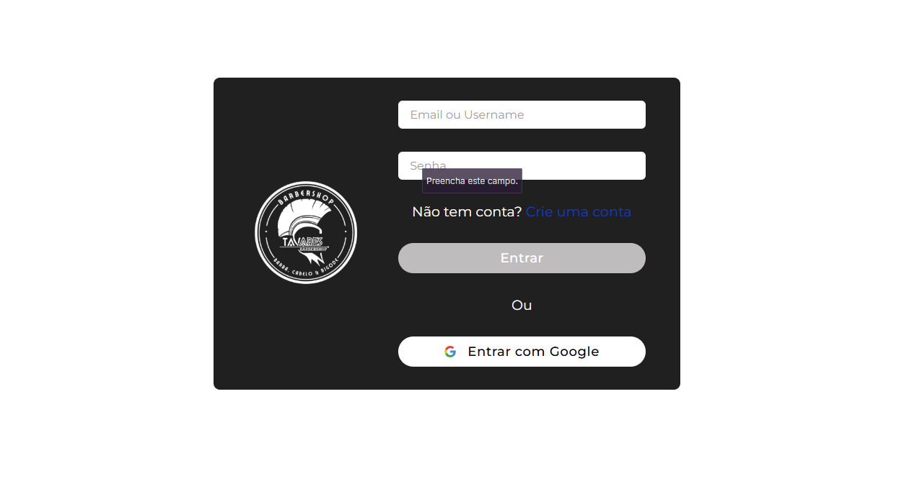

# <h1 align="center">

  <a href="https://github.com/lucas-ribeiro03/gerenciamento-de-barbearia">
    
  </a>
</h1>

<div align="center">
  gerenciamento de barbearia
  <br />
  <a href="#about"><strong>Explore the screenshots »</strong></a>
  <br /><br />
  <a href="https://github.com/lucas-ribeiro03/gerenciamento-de-barbearia/issues/new?assignees=&labels=bug&template=01_BUG_REPORT.md&title=bug%3A+">Report a Bug</a>
  ·
  <a href="https://github.com/lucas-ribeiro03/gerenciamento-de-barbearia/issues/new?assignees=&labels=enhancement&template=02_FEATURE_REQUEST.md&title=feat%3A+">Request a Feature</a>
  ·
  <a href="https://github.com/lucas-ribeiro03/gerenciamento-de-barbearia/issues/new?assignees=&labels=question&template=04_SUPPORT_QUESTION.md&title=support%3A+">Ask a Question</a>
</div>

<div align="center">
  <br />
  
  
  
</div>

<details open="open">
<summary>📚 Table of Contents</summary>

- [Sobre o Projeto](#-sobre-o-projeto)
  - [Tecnologias Utilizadas](#tecnologias-utilizadas)
- [Começando](#começando)
  - [Pré-requisitos](#pré-requisitos)
  - [Instalação](#instalação)
- [Uso](#uso)
- [Roadmap](#roadmap)
- [Suporte](#suporte)
- [Contribuindo](#contribuindo)
- [Autores](#autores)
- [Licença](#licença)

</details>

---

## 🧾 Sobre o Projeto

Esta é uma aplicação completa de gerenciamento para barbearias, com funcionalidades como:

- Agendamento de serviços com escolha de data e hora
- Autenticação de usuários (cliente e administrador), inclusive com login via Google OAuth
- Painel administrativo com estatísticas em tempo real
- Controle de pedidos e serviços com status finalizado/cancelado
- Interface moderna em React + TypeScript

> Este projeto surgiu da necessidade real de uma barbearia local, que não tinha controle digital de horários nem dos serviços realizados.

---

## Screenshots















---

### 🛠 Tecnologias Utilizadas

- **Frontend:** React + TypeScript, SCSS Modules, React Router, Axios
- **Backend:** Node.js, Express, Sequelize, MySQL
- **Autenticação:** JWT no localStorage, login via Google OAuth

---

## 🚀 Começando

### ✅ Funcionalidades do Cliente

- Escolha de data e hora disponíveis
- Visualização do agendamento atual
- Cancelamento de agendamento
- Histórico de serviços realizados (em breve)

### ✅ Funcionalidades do Administrador

- Visualização de todos os agendamentos
- Marcar serviços como finalizados ou cancelados
- Dashboard com:
  - Ganhos diários e semanais
  - Serviço mais pedido do dia
  - Total de pedidos por período
  - Carousel automático com estatísticas

### 📦 Pré-requisitos

- Node.js
- MySQL

### 🧰 Instalação

```bash
# Instalar dependências
npm install

# Rodar frontend (React)
cd client
npm run dev

# Rodar backend (Express)
cd server
npm run dev
```

---

## 📌 Uso

### Banco de Dados

Tabelas utilizadas:

- **usuarios**
- **servicos**
- **pedidos**
- **agendados**
- **horarios**

Cada agendamento tem:

- Um pedido com data, hora, barbeiro e status
- Um ou mais serviços associados
- Relacionamento com o usuário

### 📈 Dashboard & Estatísticas

A dashboard exibe, de forma automática em um carrossel:

- Ganhos do dia e da semana
- Serviço mais pedido
- Total de pedidos

As informações são baseadas em consultas Sequelize usando `fn`, `col` e `where`, considerando o campo `updatedAt` apenas para pedidos com status `"finalizado"`.

---

## 🤝 Contribuindo

Contribuições são bem-vindas! Sinta-se livre para abrir _issues_, _pull requests_ e sugerir melhorias.

---

## 👤 Autores

- Lucas Ribeiro - [@lucas-ribeiro03](https://github.com/lucas-ribeiro03)

---

## 🛡️ Licença

Este projeto está licenciado sob a Licença MIT - veja o arquivo [LICENSE](LICENSE) para detalhes.

---

## 🙏 Agradecimentos

Agradecimentos especiais às comunidades de desenvolvimento que compartilharam conhecimento e tutoriais que ajudaram na construção desse projeto. 💙
