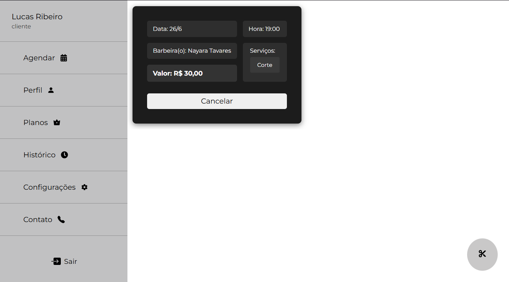
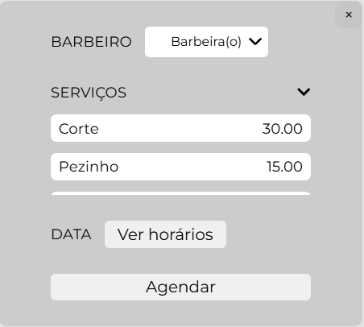
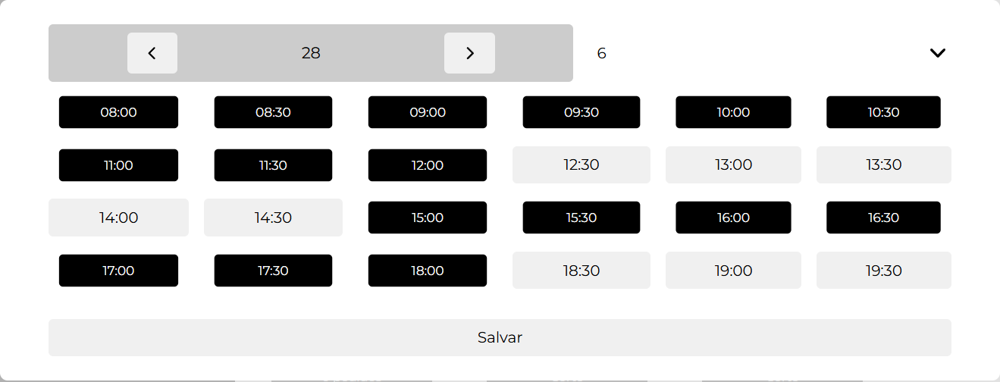
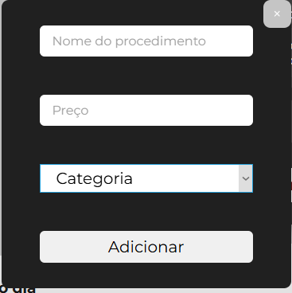
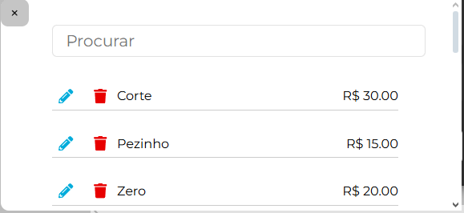
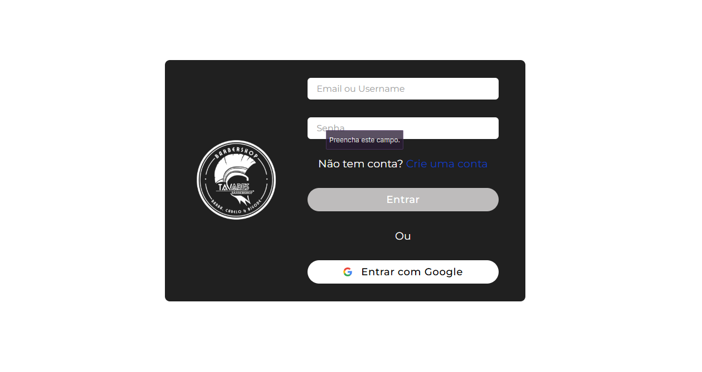

# Gerenciamento de Barbearia

Sistema completo para agendamento, gestão de clientes e serviços de uma barbearia local.

---

## Tecnologias Utilizadas

- Node.js
- React
- Express
- MySQL
- Outros...

---

## Funcionalidades

- Cadastro de clientes e barbeiros
- Agendamento e gerenciamento de serviços
- Controle financeiro básico
- Autenticação e permissões de usuário

---

## Screenshots














---

### 🛠 Tecnologias Utilizadas

- **Frontend:** React + TypeScript, SCSS Modules, React Router, Axios
- **Backend:** Node.js, Express, Sequelize, MySQL
- **Autenticação:** JWT no localStorage, login via Google OAuth

---

## 🚀 Começando

### ✅ Funcionalidades do Cliente

- Escolha de data e hora disponíveis
- Visualização do agendamento atual
- Cancelamento de agendamento
- Histórico de serviços realizados (em breve)

### ✅ Funcionalidades do Administrador

- Visualização de todos os agendamentos
- Marcar serviços como finalizados ou cancelados
- Dashboard com:
  - Ganhos diários e semanais
  - Serviço mais pedido do dia
  - Total de pedidos por período
  - Carousel automático com estatísticas

### 📦 Pré-requisitos

- Node.js
- MySQL

### 🧰 Instalação

```bash
# Instalar dependências
npm install

# Rodar frontend (React)
cd client
npm run dev

# Rodar backend (Express)
cd server
npm run dev
```

---

## 📌 Uso

### Banco de Dados

Tabelas utilizadas:

- **usuarios**
- **servicos**
- **pedidos**
- **agendados**
- **horarios**

Cada agendamento tem:

- Um pedido com data, hora, barbeiro e status
- Um ou mais serviços associados
- Relacionamento com o usuário

### 📈 Dashboard & Estatísticas

A dashboard exibe, de forma automática em um carrossel:

- Ganhos do dia e da semana
- Serviço mais pedido
- Total de pedidos

As informações são baseadas em consultas Sequelize usando `fn`, `col` e `where`, considerando o campo `updatedAt` apenas para pedidos com status `"finalizado"`.

---

## 🤝 Contribuindo

Contribuições são bem-vindas! Sinta-se livre para abrir _issues_, _pull requests_ e sugerir melhorias.

---

## 👤 Autores

- Lucas Ribeiro - [@lucas-ribeiro03](https://github.com/lucas-ribeiro03)

---

## 🛡️ Licença

Este projeto está licenciado sob a Licença MIT - veja o arquivo [LICENSE](LICENSE) para detalhes.

---

## 🙏 Agradecimentos

Agradecimentos especiais às comunidades de desenvolvimento que compartilharam conhecimento e tutoriais que ajudaram na construção desse projeto. 💙
